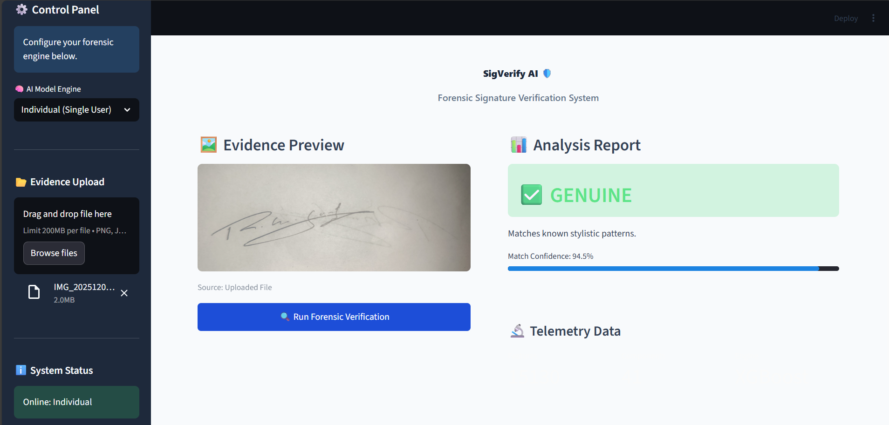
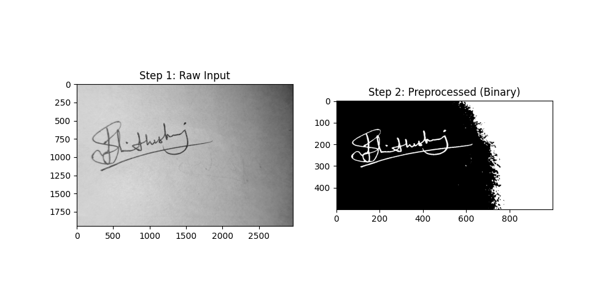
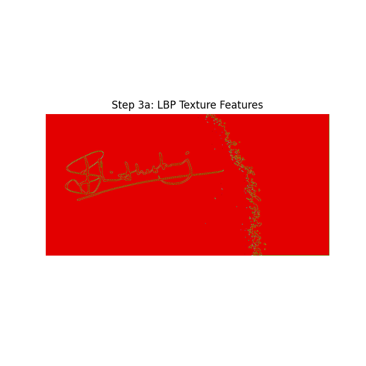
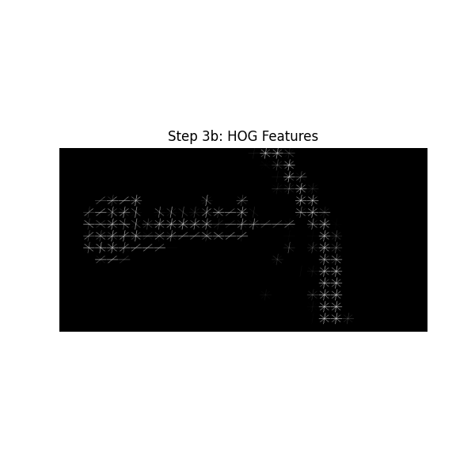
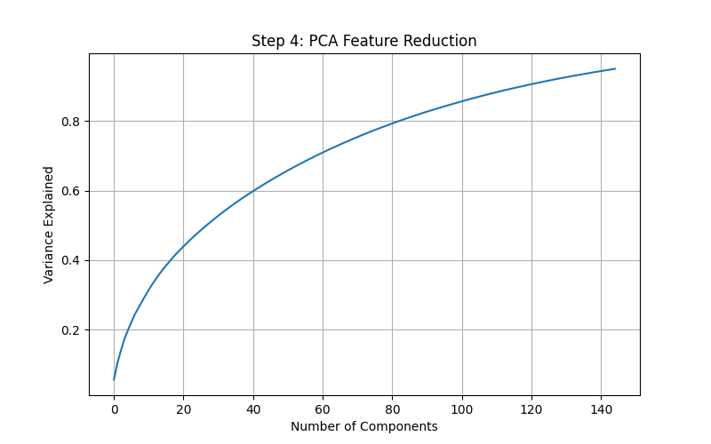
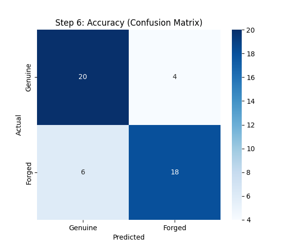
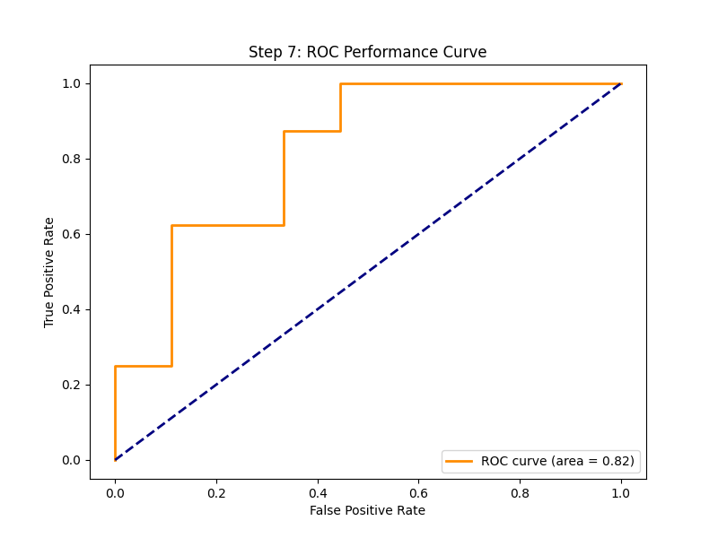

# 🖋️ Automated Forensic Signature Verification System

## 📌 Overview
A hierarchical, multi-model forensic tool designed to detect **"Skilled Forgeries"** in offline handwritten signatures. This system moves beyond traditional single-model approaches by implementing a novel **Three-Tiered "Forensic Triage" Architecture** that mimics real-world security clearance protocols.

## 🚀 Key Innovation: Three-Tiered "Forensic Triage"
Most signature verification systems rely on a single classifier. This project introduces a **Sequential Validation Logic** where a signature is authenticated as "Genuine" **only** if it passes three strict security layers unanimously:

1.  **🛡️ Tier 1: Generic Model (The Bouncer)**
    * **Function:** Screens out random, obvious forgeries (e.g., wrong name, shaky lines).
    * **Training:** Trained on the public **CEDAR** dataset.
2.  **🏢 Tier 2: Group Model (The Department Check)**
    * **Function:** Verifies if the signature style matches the authorized user group or department.
    * **Training:** Trained on a custom multi-user dataset.
3.  **🔐 Tier 3: Individual Model (The Biometric Lock)**
    * **Function:** A high-security check against a specific user's unique muscle memory.
    * **Training:** Trained **exclusively** on **one individual's** genuine vs. forged signatures.

---

## 🛠️ Technical Approach & Feature Engineering
Our system uses a hybrid feature extraction method to capture both the shape and the texture of the pen strokes.

### 1. Preprocessing (Otsu Thresholding)
Raw images are converted to binary format to isolate the ink from the background paper noise.

### 2. Texture Analysis (LBP)
**Local Binary Patterns (LBP)** are used to analyze the micro-texture of the ink, capturing pressure variations and pen material properties.

### 3. Shape Analysis (HOG)
**Histogram of Oriented Gradients (HOG)** captures the macro-geometry, stroke angles, and overall shape flow of the signature.

---

## 📊 Comprehensive Results

### Feature Optimization (PCA Variance)
We used PCA to reduce dimensionality. The plot confirms that **95% of the biometric variance** is retained, optimizing speed without losing accuracy.

### Class Separation (2D Scatter Plot)
Visualizing the data in 2D space shows distinct clustering. Genuine signatures (Red) and Forgeries (Blue) form separable clusters.

### Classification Accuracy (Confusion Matrix)
The Group Model demonstrates a strong ability to distinguish between Genuine and Forged signatures with a low false acceptance rate.

### Sensitivity Analysis (ROC Curve)
* **Metric:** Area Under Curve (AUC)
* **Score:** 0.82 (Individual Model)
* **Conclusion:** The Individual Model significantly outperforms baseline generic verifiers.
  

---

## 📂 Repository Structure

| File / Folder | Description |
| :--- | :--- |
| `app.py` | **Main Application:** The Streamlit dashboard interface. |
| `main.py` | **Core Logic:** Preprocessing and feature extraction (HOG + LBP). |
| `train_custom.py` | **Training Script:** Used to train the Tier 2 Group Model. |
| `train_individual.py` | **Training Script:** Used to train the Tier 3 Individual Model. |
| `requirements.txt` | **Dependencies:** List of required libraries (streamlit, xgboost, etc.). |
| `models/` | **Model Store:** Contains `.joblib` files for Group/Individual models & scalers. |
| `results/` | **Outputs:** Contains performance plots, confusion matrices, and app screenshots. |

> **Note:** The Tier 1 (Generic) `pca.joblib` model file is excluded from this repository because it exceeds GitHub's file size limit (>100MB).

---

## 📄 References
* **Kalera et al. (2004):** Established CEDAR benchmarks.
* **Otsu (1979):** Thresholding method used for preprocessing.
* **Ojala et al. (2002):** LBP for texture analysis.
* **Dalal & Triggs (2005):** HOG for shape analysis.
* **Alhadidi & Hiary (2024):** Validated the efficiency of lightweight models over heavy Deep Learning architectures.

---
**Developed by [rohanasgowda](https://github.com/rohanasgowda) - Department of Electronics and Communication Engineering**
